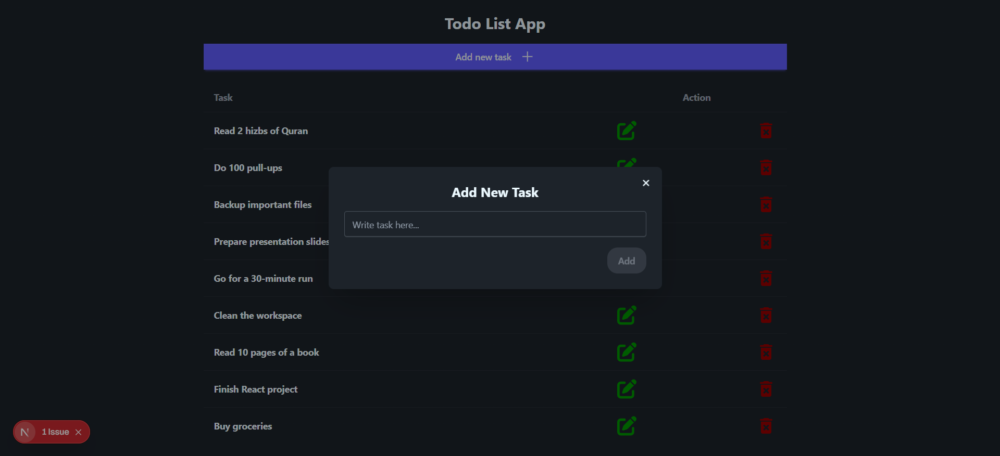
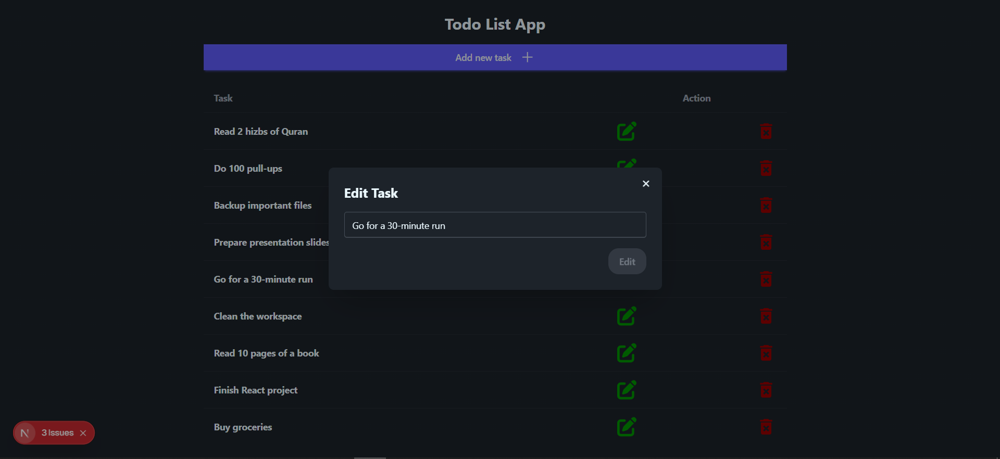
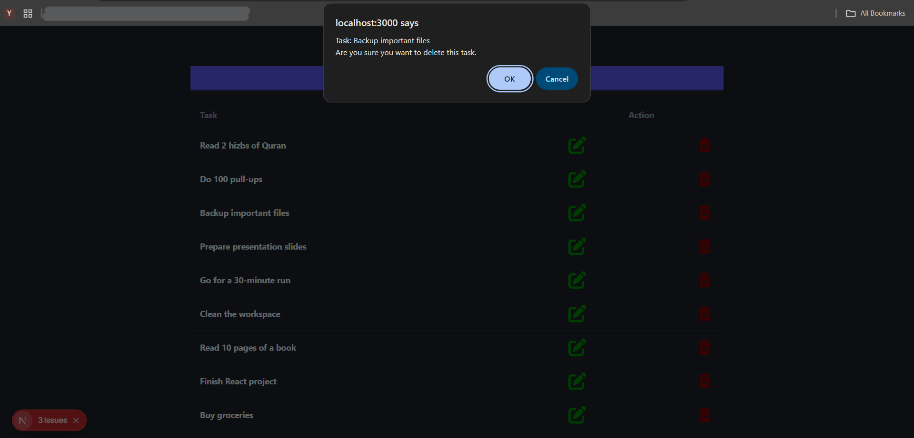
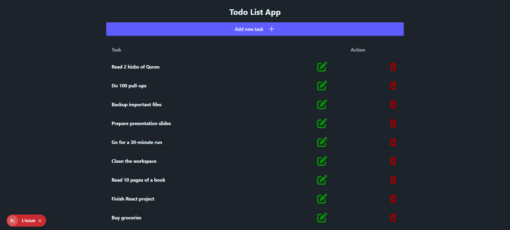

# Next.js + TypeScript Todo App

## Introduction & Description
This project is my first step into exploring **Next.js** and **TypeScript**.  
I aimed to build a simple yet **CEO-friendly app** that leverages the **Server-Side Rendering (SSR)** feature of Next.js for fast performance and SEO benefits.  

The app is a **Todo List** where users can add, edit, and delete tasks dynamically using a clean and responsive interface.

---

## Tech Stack


---

## Features
- Add a new task
- Edit existing tasks
- Delete tasks with confirmation
- Dynamic task list using a JSON server
- Fully responsive design
- SSR-powered for better SEO and performance
- UUID for unique task identification


## Installation Guide

1. **Clone the repository:**
```bash
git clone <your-repo-url>
cd next_js_todo_app
````

2. **Install dependencies:**

```bash
npm install
# or
yarn install
```

3. **Run the project (development mode):**

```bash
npm run dev
# or
yarn dev
```

This will start both the **Next.js app** and the **JSON server** simultaneously.

4. **Build and start for production:**

```bash
npm run build
npm start
```

---

## Screenshots

**Add Task**


**Edit Task**


**Delete Task**


**Task List**


---

## Project Structure

```
.
├── components
│   ├── AddTask.tsx
│   ├── Modal.tsx
│   ├── Task.tsx
│   └── TodoList.tsx
|
├── services
│   └── api.ts
|
├── types
│   └── typesIndex.ts
|
├── data
│   └── tasks.json
|
├── globals.css
├── layout.tsx
├── page.tsx
└── package.json
```

---

## Routes and API Endpoints

**Frontend Routes (Pages):**

* `/` – Main Todo list page

**API Endpoints (JSON Server):**

* `POST /tasks` – Add a new task
* `PUT /tasks/:id` – Update a task
* `DELETE /tasks/:id` – Delete a task

**Notes:**

* The frontend communicates with a JSON server running on `http://localhost:3333`.
* All API calls are handled via the `services/api.ts` file.
